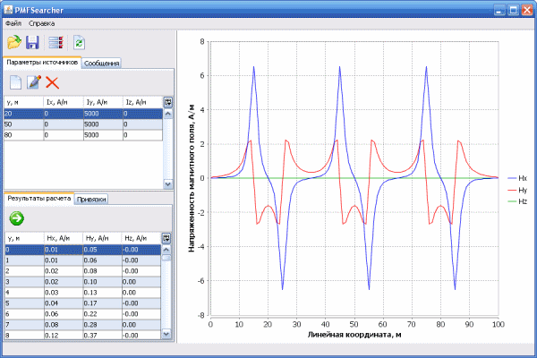

**PMFSearcher**

Pipeline Magnetic Field Searcher

Solution of the direct problem of magnetostatics in relation to an underground pipeline. Calculation of the dependences of the three components of the magnetic field intensity vector on the linear coordinate at different values of magnetization and geometric parameters of the magnetic field sources.

